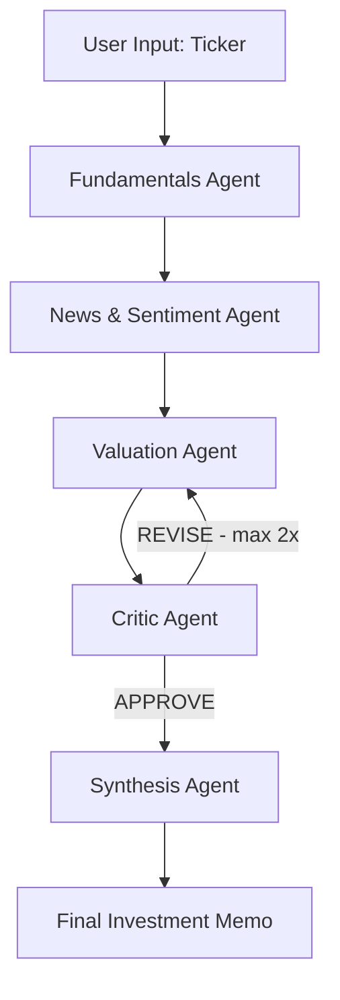

# 📈 Equity Research Analyst Crew

A multi-agent AI system that takes a stock ticker and produces a professional investment research memo. Built with LangGraph for orchestration and Claude (Anthropic) as the LLM for every agent.

The defining feature is a **critic/revision loop** — a critic agent reviews intermediate outputs and can route the workflow back for revision before final synthesis, demonstrating real multi-agent orchestration rather than simple prompt chaining.


---

## Architecture



## Agents

| Agent | Input | Action | Output |
|---|---|---|---|
| Fundamentals | Ticker | Fetches yfinance data, Claude summarizes ratios + red flags | `fundamentals_summary` |
| News/Sentiment | Company name | Claude web search for last 30 days of news | `news_summary` |
| Valuation | Fundamentals data | Claude writes + executes DCF/comps Python, interprets results | `valuation` |
| Critic | All three summaries | Reviews for contradictions, missing risks, weak assumptions | `critic_feedback` |
| Synthesis | All state fields | Writes final one-page memo incorporating critic's concerns | `final_memo` |

## Shared State

All agents communicate through a single `ResearchState` TypedDict — no direct agent-to-agent calls:

```python
class ResearchState(TypedDict):
    ticker: str
    company_name: Optional[str]
    fundamentals_data: Optional[dict]
    fundamentals_summary: Optional[str]
    news_summary: Optional[str]
    valuation: Optional[str]
    critic_feedback: Optional[str]
    final_memo: Optional[str]
    revision_count: int
    agent_config: Optional[dict]
```

## Why the Critic/Revision Loop?

In a naive pipeline, each agent runs once and passes output forward — there's no quality gate. Errors, contradictions, or missing risks from one agent get silently carried into the final memo.

The critic loop solves this by introducing a feedback mechanism:

1. The critic receives all three prior outputs and checks for internal contradictions, unsupported assumptions, missing risks, and methodology weaknesses.
2. If it finds issues, it returns `REVISE: <specific reason>` — the graph routes back to the valuation agent with the critic's feedback injected into the prompt.
3. The valuation agent explicitly addresses the flagged concerns in its revised output.
4. This repeats up to 2 times (hard-capped in the conditional edge, not just by prompt instruction).

This demonstrates a core pattern in multi-agent design: agents as reviewers, not just producers. The system can catch its own errors before they reach the user.

## Setup

```bash
# 1. Clone the repo
git clone https://github.com/muhimra/equity-research-crew.git
cd equity-research-crew

# 2. Create and activate virtual environment
python -m venv venv
venv\Scripts\activate      # Windows
source venv/bin/activate   # Mac/Linux

# 3. Install dependencies
pip install -r requirements.txt

# 4. Add your API key
cp .env.example .env
# Edit .env and add your Anthropic API key

# 5. Run the app
streamlit run app.py
```

## Features

- 🔄 **Live pipeline visualization** — watch each agent activate in real time
- 🔁 **Visible revision loop** — see when the critic requests revision and the valuation reruns
- ⚙️ **Per-agent model selection** — choose between Claude Sonnet and Haiku per agent from the sidebar
- 📊 **Dual valuation approaches** — DCF or P/E comps, selectable before each run
- ⬇️ **Downloadable memo** — export the final memo as a `.md` file

## Example Output

> **TSLA memo — critic triggered revision loop twice before synthesis**
>
> **Recommendation: HOLD**
>
> Tesla's DCF intrinsic value of $111.7B versus $1.45T market cap (-92% downside) reflects the market pricing in decades of hyper-growth rather than current fundamentals. FCF of $4.84B is real but modest relative to valuation. The critic flagged missing WACC disclosure, FCF contradictions between sections, and absent sensitivity analysis — all addressed in the revised valuation. Recommend holding existing positions but not adding at current multiples without evidence of sustained FCF expansion above $20B.


Why LangGraph: the critic/revision loop requires conditional branching back to an earlier step with a hard iteration cap — a pattern that's awkward to express as a linear chain but maps directly onto LangGraph's graph-based state machine.

## Known Limitations

- Valuation is a simplified DCF/comps model — not a substitute for professional financial analysis
- yfinance data can lag or have missing fields for smaller/international tickers
- Web search results depend on Claude's tool availability and may not always reflect breaking news
- Code execution uses a restricted `exec()` namespace — sufficient for demo purposes, not production-grade sandboxing
- US/Yahoo-covered tickers only
- Not investment advice

## Stack

- **Orchestration:** LangGraph
- **LLM:** Anthropic Claude (`claude-sonnet-4-5`)
- **Data:** yfinance
- **Frontend:** Streamlit
- **Language:** Python 3.10+
